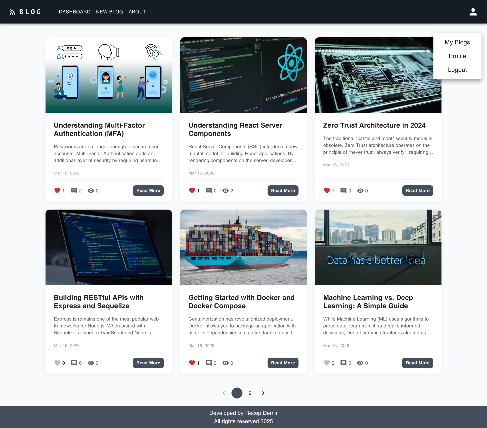

# Full-Stack Blog Application (PERN Stack)

A high-performance, modern, and fully responsive blog platform built with the **PERN stack** (PostgreSQL, Express.js, React, Node.js). This application transitioned from a NoSQL (MongoDB) structure to a robust **Relational Database (PostgreSQL)** using **Sequelize ORM**, offering advanced data integrity and relational features.

## 🔗 Live Demo

**Frontend:** [https://senin-projen.netlify.app/](https://milestone-blogapp-pern.netlify.app/)

**Backend API:** [https://milestone-blogapp-pern.onrender.com/](https://milestone-blogapp-pern.onrender.com/)

---

### 🔑 Test Credentials

To explore the application without creating a new account, you can use the following test user:

* **Username:** `test1`
* **Password:** `Password123$`

---


---

## 🚀 Features

* **Relational Data Management:** Fully migrated to **PostgreSQL** for better data structure and query performance.
* **Dynamic Content:** Full CRUD operations for Blogs, Categories, and Comments.
* **Smart Engagement:** - **Like System:** Interactive "Like" functionality that persists in the Postgres array.
* **Visitor Counter:** Real-time visit tracking for every blog post.
* **Comment System:** Nested data relations for users and blog comments.


* **Advanced Pagination:** URL-based pagination (`/?page=1`) for seamless navigation and SEO-friendly routing.
* **Modern UI/UX:**
* **Responsive Design:** Optimized for Mobile, Tablet, and Desktop.
* **Modern Cards:** Clean, elevated design with hover effects.
* **Sticky Footer:** Professional layout management.


* **State Management:** Handled via **Redux Toolkit** for global data sync and authentication.
* **API Documentation:** Interactive documentation powered by **Swagger**.

---

## 🛠 Tech Stack

### Frontend (Client)

* **Framework:** React 18 (Vite)
* **UI Library:** Material-UI (MUI)
* **State Management:** Redux Toolkit
* **Routing:** React Router DOM (v6)
* **HTTP Client:** Axios
* **Form Handling:** Formik & Yup
* **Notifications:** React Toastify

### Backend (Server)

* **Runtime:** Node.js
* **Framework:** Express.js
* **Database:** PostgreSQL (Cloud hosted on **Neon.tech**)
* **ORM:** Sequelize
* **Authentication:** Token-based authentication
* **Documentation:** Swagger Autogen

---

## 📂 Folder Structure

```text
📦 milestone-blogapp-pern
┣ 📂 client                 # Frontend (React + Vite)
┃ ┣ 📂 src
┃ ┃ ┣ 📂 features          # Redux slices (authSlice, blogSlice)
┃ ┃ ┣ 📂 hooks             # Custom hooks (useBlogCalls, useAuthCalls, useAxios)
┃ ┃ ┣ 📂 pages             # Views (Dashboard, Detail, MyBlog, Profile)
┃ ┃ ┣ 📂 components        # UI parts (Navbar, Footer, BlogCard, Modals)
┃ ┃ ┗ 📜 main.jsx          # Entry point
┃ ┗ 📜 netlify.toml        # Netlify deployment config
┣ 📂 server                 # Backend (Express + Sequelize)
┃ ┣ 📂 src
┃ ┃ ┣ 📂 configs           # DB connection (PostgreSQL/SSL)
┃ ┃ ┣ 📂 controllers       # Logic for blogs, likes, and comments
┃ ┃ ┣ 📂 middlewares       # Auth, error handling, permissions
┃ ┃ ┣ 📂 models            # Sequelize models (Blog, User, Comment, Category)
┃ ┃ ┗ 📂 routes            # API endpoints
┃ ┣ 📜 index.js            # Server entry point
┃ ┗ 📜 sync.js             # DB synchronization & seed data script
┗ 📜 README.md

```

---

## 💻 Getting Started

### 1. Clone the Repository

```bash
git clone https://github.com/recep-demir/Milestone-BlogApp-PERN.git
cd Milestone-BlogApp-PERN

```

### 2. Backend Setup (Server)

```bash
cd server
npm install

```

Create a `.env` file in the `server` folder:

```env
PORT=8000
DATABASE_URL=your_postgresql_connection_string
SECRET_KEY=your_secret_key

```

Run the sync script to create tables and load sample data:

```bash
npm run dev # This will trigger sync and start nodemon

```

### 3. Frontend Setup (Client)

```bash
cd client
npm install

```

Create a `.env` file in the `client` folder:

```env
VITE_BASE_URL=http://localhost:8000/

```

Start the development server:

```bash
npm run dev

```

---

## 👨‍💻 Author

**Recep Demir** [](https://www.linkedin.com/in/recep-demir/)
[](https://github.com/recep-demir)

---

